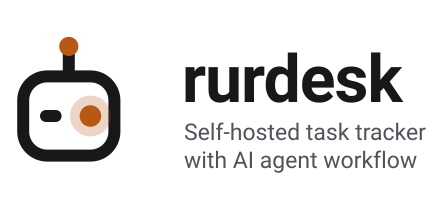
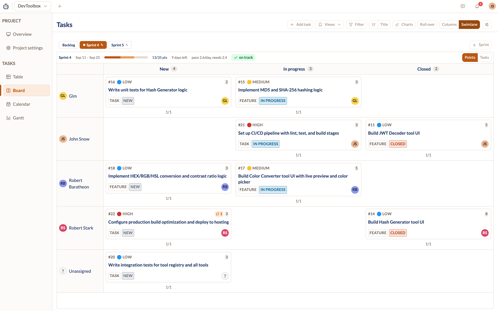
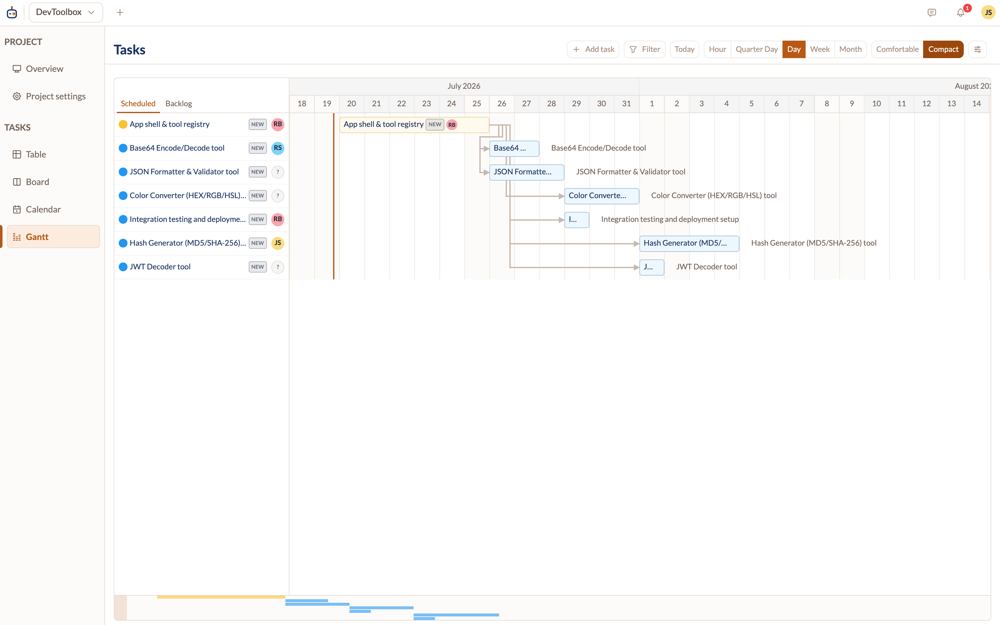
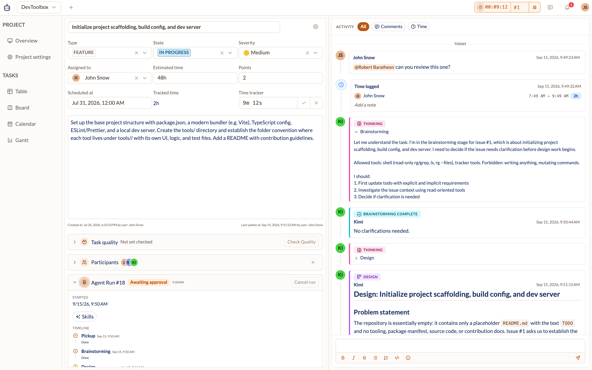
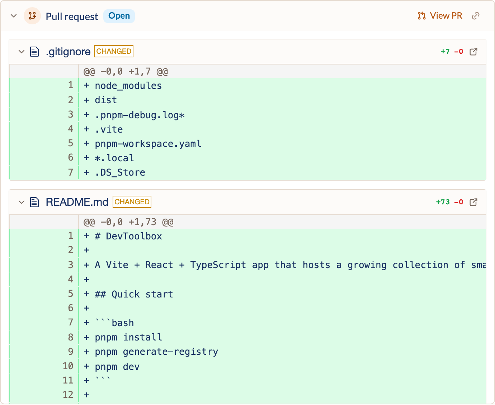
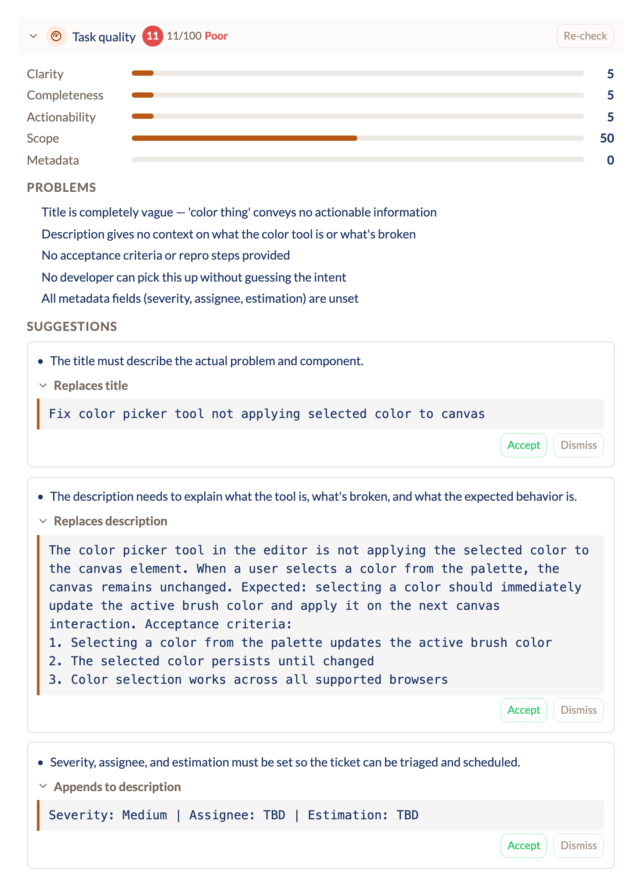
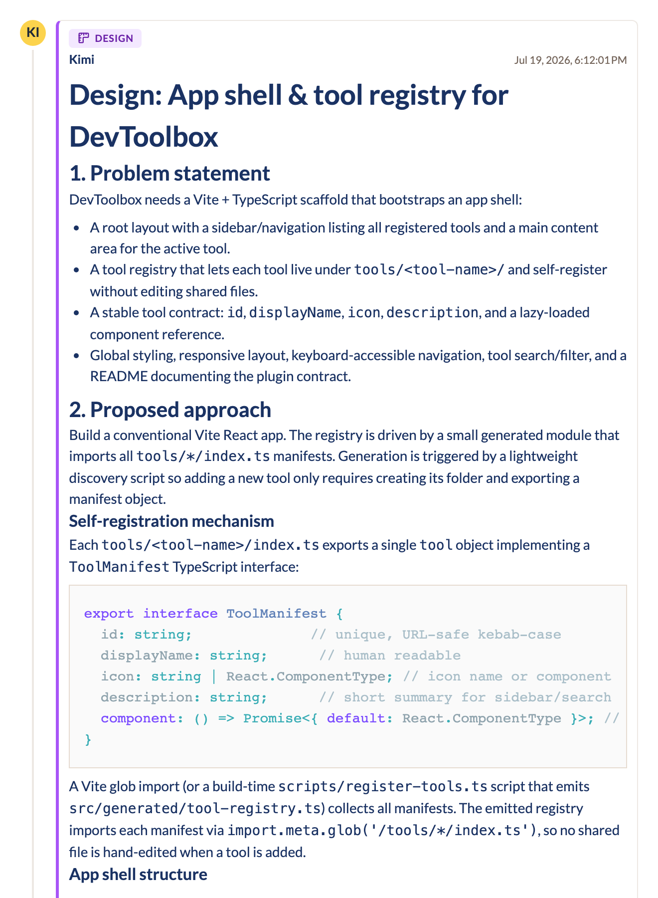
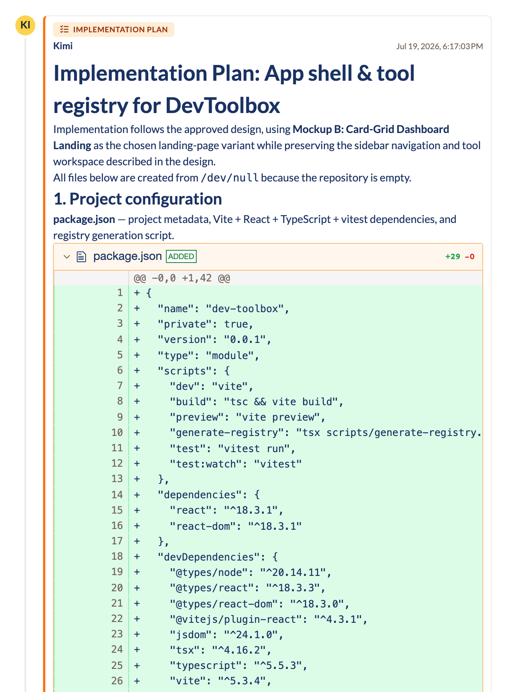

<p align="center">
  <picture>
    <source media="(prefers-color-scheme: dark)" srcset="assets/banner-dark.svg">
    
  </picture>
</p>

<p align="center">
  <a href="https://rurdesk.com">Website</a>
  &nbsp;·&nbsp;
  <a href="https://rurdesk.com/docs">Documentation</a>
  &nbsp;·&nbsp;
  <a href="https://rurdesk.com/docs/installation.html">Installation</a>
</p>

<p align="center">
  <a href="https://github.com/bitmaster-sk/rurdesk/releases"></a>
  <a href="https://github.com/bitmaster-sk/rurdesk/actions/workflows/ci.yml"></a>
  <a href="LICENSE"></a>
  <a href="https://github.com/sponsors/bitmaster-sk"></a>
</p>

Rurdesk is a self-hosted task tracker where AI agents work as team members:
assign an issue to an agent and it comes back as a branch and a pull request,
with progress reported into the tracker as it happens. Everything runs on your
own infrastructure — the whole app (Go API, WebSocket, MCP server, Angular UI)
ships as a single container, with Postgres and Redis next to it. The agent
part is optional; without it you get a fast, ordinary issue tracker.

| | |
| --- | --- |
|  |  |
|  |  |

The quality check reviews an issue before anyone (human or agent) picks it up,
and an agent posts its design and implementation plan back into the tracker as
it works:

| | | |
| --- | --- | --- |
|  |  |  |

▶ [Watch the agent workflow demo](https://rurdesk.com/#agents) — an issue is
assigned to an agent, worked on, and comes back as a pull request.

# Features

- **Four views** of the same issues: table, kanban, calendar, and gantt.
- **Sprints, relations & scheduling** — hierarchy, dependencies, duplicates,
  sprint rollover.
- **Time tracking** built into issues.
- **Real-time collaboration** — messages, mentions, and notifications over
  WebSocket; no refresh needed.
- **Git integration** — link branches and merge requests to issues and read
  their diffs in the tracker.
- **AI assists** (bring your own API key): quality check for issue
  descriptions, project kickstarter, and splitting oversized tasks.
- **Agent gateway** (optional) — agents pick up assigned issues, work in
  isolated git worktrees, and open pull requests.
- **MCP server** built in — connect Claude Code or any MCP client to the
  tracker directly.
- **Command palette** and keyboard shortcuts throughout.

The [documentation](https://rurdesk.com/docs) covers each of these in detail.

# Installation

The stack is three services — `rurdesk`, Postgres, and Redis — brought up by
one Docker Compose file; the agent gateway is a fourth, optional one. No
source checkout or build step is needed:

```bash
docker pull ghcr.io/bitmaster-sk/rurdesk/rurdesk:latest
```

Follow the [installation guide](https://rurdesk.com/docs/installation.html)
for the complete compose file and the
[configuration reference](https://rurdesk.com/docs/configuration.html)
for the environment variables.

## Container images

Prebuilt multi-arch (amd64/arm64) images are published to GHCR on every
release:

| Image | What | Pull |
| --- | --- | --- |
| [`rurdesk`](https://github.com/bitmaster-sk/rurdesk/pkgs/container/rurdesk%2Frurdesk) | API + WebSocket + MCP + Angular SPA in a single container | `docker pull ghcr.io/bitmaster-sk/rurdesk/rurdesk:latest` |
| [`gateway-goose`](https://github.com/bitmaster-sk/rurdesk/pkgs/container/rurdesk%2Fgateway-goose) | Optional agent gateway (goose) | `docker pull ghcr.io/bitmaster-sk/rurdesk/gateway-goose:latest` |

Pin a version tag (e.g. `:1.0.0`) instead of `latest` for deliberate upgrades.

# Developers

## Components

| Path                   | What                                                       | Setup docs                               |
| ---------------------- | ---------------------------------------------------------- | ---------------------------------------- |
| [`api/`](api/)         | Go backend, REST + WebSocket + MCP server                  | [`api/README.md`](api/README.md)         |
| [`client/`](client/)   | Angular 21 frontend                                        | [`client/README.md`](client/README.md)   |
| [`gateway/`](gateway/) | Stateless agent runner (goose + claude-code adapters)      | [`gateway/README.md`](gateway/README.md) |

## Documentation site

[`site/`](site/) holds the landing page and user docs — a hand-crafted
`index.html` plus pages generated from the Markdown in `site/content/`. See
[`site/README.md`](site/README.md) for details. Build it with:

```bash
cd site
npm install          # once
node tools/build.mjs # → dist/
```

Then open `site/dist/index.html` in a browser (works straight from disk).

## Quick start (development)

Two things must exist before the stack will come up: the `.env` files (they are
gitignored, so only `.env.example` is in the repo) and the gateway image (it is
built locally, not pulled).

```bash
# 1. One .env per service folder that ships an .env.example, then fill in the values.
for d in docker/api docker/gateway-goose-*; do cp "$d/.env.example" "$d/.env"; done

# 2. Build the gateway image docker-compose.yml refers to by plain tag.
./script/build-gateway.sh

# 3. Start everything.
docker compose up
```

Builds and runs the stack from source: nginx proxy (`:80`), API (`:1000`
internal), Postgres (`:5432`), Redis (`:6379`), and three goose gateway workers.
The UI is then on <http://localhost>. The first start installs the client's npm
dependencies inside its container, so it takes a few minutes before the proxy
stops answering 502.
See [`gateway/README.md`](gateway/README.md) for what the gateway does and which
provider credentials its `.env` needs. If you don't want agent workers, comment
the `gateway-goose-*` services out of [`docker-compose.yml`](docker-compose.yml)
and skip steps 1–2 for those folders.

## Deployment (published images)

In production the whole web stack is a **single `rurdesk` image** — the Go
binary serves the REST API, WebSocket, the MCP endpoints and the Angular SPA on
one port (no separate nginx/client/proxy containers; that 3-container split
exists only in the development compose above).

## Cutting a release

Images are built and pushed by
[`.github/workflows/docker-release.yml`](.github/workflows/docker-release.yml),
which triggers on any `v*` tag:

```bash
git tag -a v1.0.0 -m "Release 1.0.0"
git push origin v1.0.0
```

Creating a GitHub Release through the web UI works too — it pushes the tag,
which fires the workflow. (A release created by automation using
`GITHUB_TOKEN` would *not* trigger it; GitHub suppresses those events to
prevent workflow loops.)

Each of the three images gets the version tag, plus `latest` when the tag has
no pre-release suffix. The tracker build stamps the version and commit into the
Go binary via `-ldflags` (see [`api/internal/buildinfo`](api/internal/buildinfo)),
so a running instance can report its own release at
`GET /api/private/admin/version` and in the admin settings panel. A local build
leaves the defaults `dev` / `unknown`.

# License

Copyright © 2024–2026 BitMaster s.r.o.

Rurdesk is licensed under the **GNU Affero General Public License v3.0** (see
[`LICENSE`](LICENSE)). In short: you may use, modify, and self-host it freely,
but if you run a modified version as a network service, you must make your
modified source available to its users.

A **commercial license** is available for anyone who wants to use Rurdesk
without the AGPL's obligations (for example, embedding it in a closed-source
product or offering it as a hosted service without publishing changes).
Commercial licensing is handled by BitMaster s.r.o. — write to
<info@bitmaster.sk> to arrange one.
